# AVL

自平衡二叉树

特点：AVL树中左子树小于父节点，右子树大于父节点，任何节点的两个子树的高度最大差别为1

## 操作

### 插入

分为四种情况

1. 在左子树左边插入，称为LL型

    如图插入1之后节点5失衡

    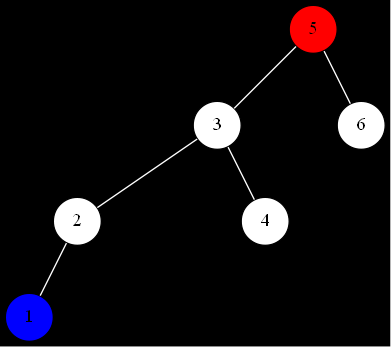

    调整方法为右旋

    
  
2. 在右子树右边插入，称为RR型

    如图插入6之后节点2失衡

    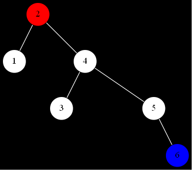

    调整方法为左旋

    

3. 在左子树右边插入，称为LR型

    如图插入4之后节点7失衡

    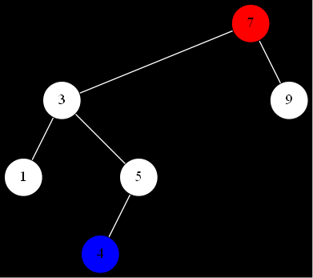

    调整方法为先对左子树左旋

    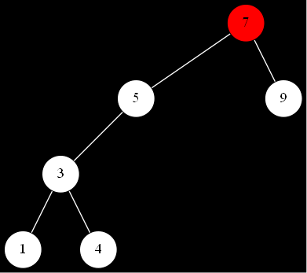

    再右旋

    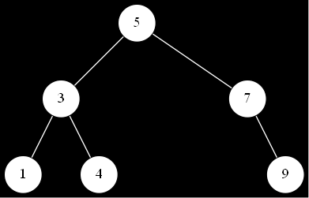

    或者如图插入6之后节点7失衡

    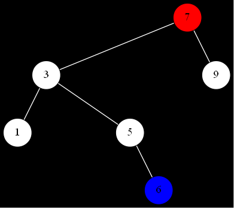

    调整方法相同，先对左子树左旋再右旋

    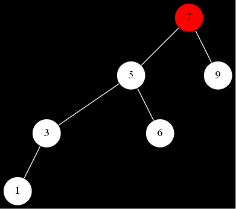

    

4. 在右子树左边插入，称为RL型

    如图插入4之后节点3失衡

    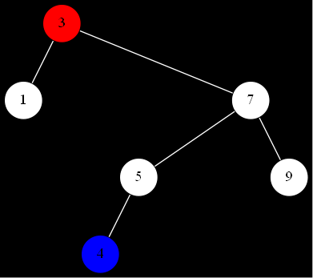

    调整方法为先对右子树右旋

    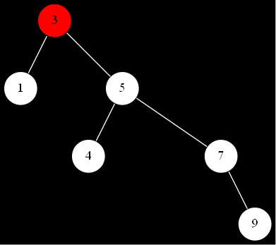

    再左旋

    

    或者如图插入6之后节点3失衡

    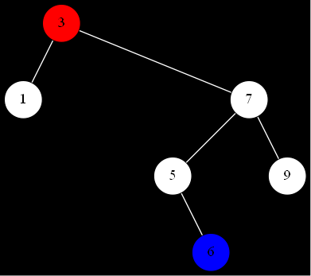

    调整方法相同，先对右子树右旋再左旋

    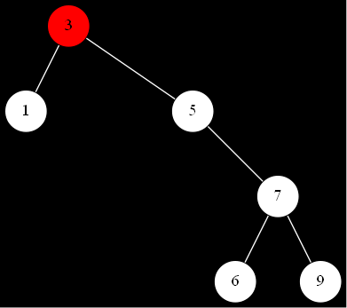

    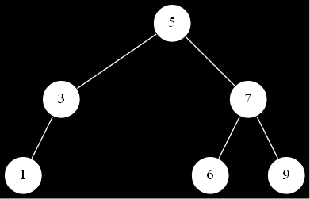

### 删除

分为两大类情况

1. 删除节点只含有左子树或只含有右子树或没有子树

    有子树则用子树代替该节点没有则直接删除，以删除节点回溯调节平衡

2. 删除节点既含有左子树也含有右子树

   这里做法比较巧妙，不是直接删除，而是想办法将这种情况转化为第一种情况，具体方法为：

   找到删除节点的前驱节点或者后继节点，将值赋给删除节点，情况转化为删除前驱节点或后继节点，即第一种情况(思考为什么？)

## 代码实现

avl.c